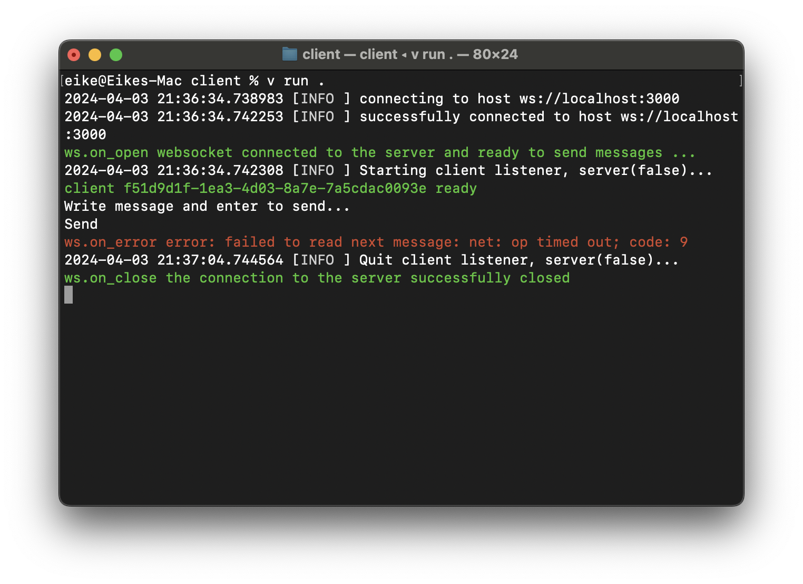

# Beispiel 2 für einen Websocket-Server in V

Dieses Beispiel basiert auf einem Beispiel aus der offizielen Dokumentation zu VLang ([client-server](https://github.com/vlang/v/tree/master/examples/websocket/client-server)).

Bei diesem Beispiel meldet der Websocket-Client nach einigen Sekunden, das er keine Nachricht empfangen kann. Diese Fehlermeldung führt dazu, dass das Programm für den Websocket-Client vollständig beendet wird. Eine Lösung hierfür konnte bisher noch nicht gefunden werden.

